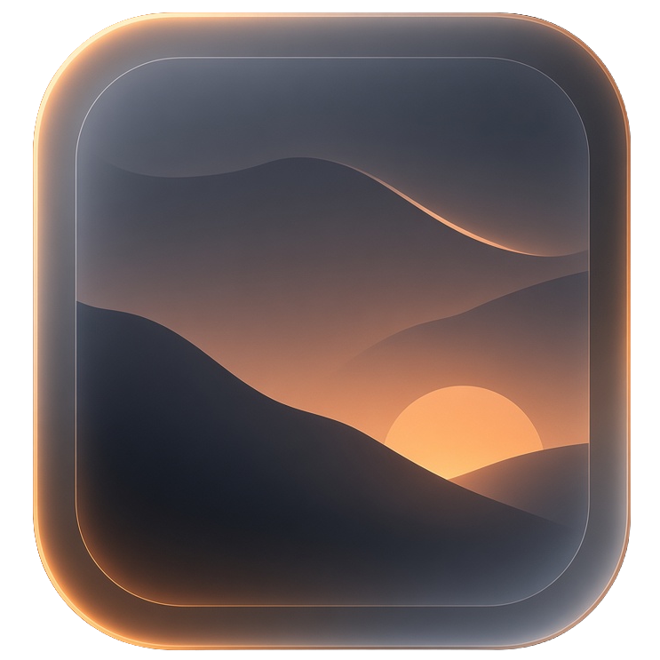

# Omaview

<div align="center">
  
  <h3>Dead-simple, instant, theme-aware image viewer for Omarchy Linux under Hyprland</h3>
</div>

---

## ✦ Philosophy & Identity

Omaview is designed from first principles for **Omarchy Linux** and the **Hyprland** wayland compositor:
- **Zero Bloat**: Pure Rust 2024 edition on top of GTK4 + Libadwaita. No external heavy frameworks, no electron, no background daemons, no database engines.
- **Instantaneous**: Starts in `< 150 ms`, with asynchronous background decoding, neighbor prefetching, and multi-resolution thumbnail generation.
- **Hyprland Native**: Glass translucency, subtle borders, floating pill chrome, and native Wayland fractional scaling.
- **Theme Aware**: Listens to Omarchy's theme engine (`~/.local/state/omarchy/current/theme/colors.toml`) and live-recolors immediately via hot-reload without restarting the application.
- **Safe & Non-Destructive**: Core editing (crop, rotate, flip, adjustments) runs entirely in-process. File deletion delegates strictly to `gio::File::trash`—never permanent unrecoverable deletion by default.

---

## ✦ Features & Layout

1. **Home Screen & Album Management**
   - Launches directly into the **Home Screen** when opened from application launchers (no file arguments passed).
   - **Add Folder as Album**: Centered floating pill button (`[ 📁 Add Folder as Album ]`) allows adding any folder from your filesystem as an album.
   - **Default Pictures Album**: Defaults to Omarchy's `~/Pictures` folder automatically.
   - **Horizontal Album Strips**: Each album is displayed as a horizontal shelf with folder name, photo count, path hint, quick-open button (`▶`), and remove button (`✕`).
   - **Large Thumbnails**: Beautiful cards with rounded corners (`10px`), aspect-fill crop, filename label, and subtle hover accent glow.
   - **Instant Viewer Launch**: Clicking any thumbnail opens the full image viewer centered on that photo with the album's photos loaded in the right rail.

2. **Top-Left Home Navigation**
   - Floating pill button (`[ ⌂ ]`) at top-left next to the metadata pill in the image viewer.
   - Instantly returns to the Home Screen (<kbd>Home</kbd> or <kbd>Esc</kbd>).

3. **Expansive Viewport (~85–90% width)**
   - Centered image rendering with smooth bilinear anti-aliasing and rounded corners (`12px`).
   - Hardware-accelerated drawing via Cairo.
   - Smooth pan & zoom centered at mouse cursor or window center.
   - Interactive Crop mode with Rule-of-Thirds grid guidelines and 8 draggable bounding box handles.
   - Drag-and-drop file ingestion directly onto the viewport.

4. **Center-Pinned Filmstrip Rail**
   - Vertical thumbnail rail along the right edge.
   - Exact mathematical center-pinning algorithm keeping the active image centered:
     $$\text{offset}_y = \frac{H}{2} - \left(i \cdot h + \frac{h}{2}\right)$$
   - Soft alpha fade towards top and bottom edges.
   - Glowing accent ring (`--accent`) around the active thumbnail.
   - Vertical active indicator pill on the left edge and numeric index indicator below the thumbnail.
   - Smooth click-to-jump and mouse wheel navigation.

5. **Floating Bottom Pill Toolbar**
   - Rounded capsule floating at the bottom center matching the Omarchy design system:
     `[ Previous ] [ Filmstrip ] [ Zoom In ] (•) [ Zoom Out ] [ Crop ] [ Rotate ] [ Adjustments ] [ Info ] [ Trash ]`
   - Active highlight indicators for toggled states.
   - Real-time adjustments drawer:
     - **Exposure** (-100 to +100)
     - **Contrast** (-100 to +100)
     - **Saturation** (-100 to +100)
     - **Warmth / Temperature** (-100 to +100)

6. **Floating Top Metadata Pill**
   - Sleek auto-hiding capsule at the top-left showing:
     `filename | width × height | zoom% | index/total`
   - Auto-hides along with chrome during idle mouse inactivity.

7. **Floating Navigation Chevrons**
   - Semi-transparent left (`<`) and right (`>`) navigation chevrons vertically centered on the viewport edges for effortless one-click paging.

8. **Zen Mode**
   - Press <kbd>Tab</kbd> or <kbd>z</kbd> to vanish all chrome, toolbars, pills, and filmstrip for complete edge-to-edge immersion.

---

## ✦ Keyboard & Mouse Controls

### Keyboard Shortcuts

| Shortcut | Action |
| :--- | :--- |
| <kbd>j</kbd> / <kbd>→</kbd> / <kbd>Space</kbd> | Next image |
| <kbd>k</kbd> / <kbd>←</kbd> / <kbd>Backspace</kbd> | Previous image |
| <kbd>+</kbd> / <kbd>=</kbd> / <kbd>Ctrl</kbd>+<kbd>↑</kbd> | Zoom in |
| <kbd>-</kbd> / <kbd>_</kbd> / <kbd>Ctrl</kbd>+<kbd>↓</kbd> | Zoom out |
| <kbd>0</kbd> | Actual size (100%) |
| <kbd>f</kbd> | Fit to window |
| <kbd>r</kbd> | Rotate 90° Clockwise |
| <kbd>R</kbd> (<kbd>Shift</kbd>+<kbd>r</kbd>) | Rotate 90° Counter-Clockwise |
| <kbd>h</kbd> | Flip horizontal |
| <kbd>v</kbd> | Flip vertical |
| <kbd>c</kbd> | Toggle interactive crop mode |
| <kbd>Enter</kbd> | Apply crop |
| <kbd>a</kbd> / <kbd>e</kbd> | Toggle adjustments drawer (Exposure, Contrast, Saturation, Warmth) |
| <kbd>i</kbd> | Toggle detailed EXIF metadata popover |
| <kbd>d</kbd> / <kbd>Delete</kbd> | Move image to Trash (via `gio::File::trash`) |
| <kbd>g</kbd> | Toggle filmstrip visibility |
| <kbd>s</kbd> | Save changes (Prompt for Overwrite or Save As) |
| <kbd>Tab</kbd> / <kbd>z</kbd> | Toggle Zen mode (edge-to-edge view) |
| <kbd>F11</kbd> | Toggle fullscreen |
| <kbd>Esc</kbd> | Cancel crop / Close popup / Quit |
| <kbd>q</kbd> | Quit application |
| <kbd>?</kbd> / <kbd>F1</kbd> | Open Keyboard Shortcuts dialog |

### Mouse & Gesture Controls

- **Scroll Wheel**: Zoom in / out centered at cursor position.
- **Left Click + Drag**: Pan image when zoomed in past fit size.
- **Double Click**: Toggle between Fit to Window and 100% Actual Size.
- **Middle Click**: Reset zoom to Fit to Window.
- **Drag and Drop**: Drag an image file or directory into the window to open it immediately.

---

## ✦ Hyprland Integration

Add the following rules to your `~/.config/hypr/hyprland.conf`:

```ini
# Blur and translucency for Omaview floating chrome
windowrulev2 = blur, class:^(org.omarchy.omaview|omaview)$
windowrulev2 = opacity 0.96 0.90, class:^(org.omarchy.omaview|omaview)$

# Optional: Open floating by default with standard dimensions
windowrulev2 = float, class:^(org.omarchy.omaview|omaview)$
windowrulev2 = size 1120 760, class:^(org.omarchy.omaview|omaview)$
windowrulev2 = center, class:^(org.omarchy.omaview|omaview)$
```

---

## ✦ Live Theme Recoloring

Omaview monitors `~/.local/state/omarchy/current/theme/colors.toml` using `notify` (inotify on Linux).
When Omarchy switches colors or modes (e.g. Catppuccin, Tokyo Night, Gruvbox, Nord):
- CSS variables (`--accent`, `--bg-base`, `--fg-primary`, etc.) are updated live.
- Viewport backgrounds, pill borders, selection rings, and Cairo gradient fades redraw automatically with zero frame drops and without restarting the app.

---

## ✦ Building from Source

### Prerequisites

- Rust 1.80+ (tested on Rust 2024 edition)
- GTK4 (`gtk4 >= 4.12`)
- Libadwaita (`libadwaita >= 1.5`)
- pkg-config

On Arch Linux / Omarchy:
```bash
sudo pacman -S --needed gtk4 libadwaita cargo pkgconf
```

### Build & Run

```bash
# Build release binary
cargo build --release --locked

# Run with test image or folder
./target/release/omaview path/to/image.jpg
```

---

## ✦ Cross-Compilation Notes

Omaview is pure Rust except for GTK4 / Libadwaita C bindings.

### Cross-compiling for `aarch64` (e.g. Raspberry Pi 5, Asahi Linux, Pinebook Pro)

1. Install cross-toolchain and target libraries:
   ```bash
   sudo pacman -S aarch64-linux-gnu-gcc
   rustup target add aarch64-unknown-linux-gnu
   ```
2. Export PKG_CONFIG sysroot pointing to aarch64 libraries:
   ```bash
   export PKG_CONFIG_SYSROOT_DIR="/usr/aarch64-linux-gnu"
   export PKG_CONFIG_PATH="/usr/aarch64-linux-gnu/lib/pkgconfig"
   cargo build --target aarch64-unknown-linux-gnu --release
   ```
   Or use `cross`:
   ```bash
   cross build --target aarch64-unknown-linux-gnu --release
   ```

### Cross-compiling for `riscv64` (e.g. VisionFive 2, Star64, Lichee Pi 4A)

1. Add target:
   ```bash
   rustup target add riscv64gc-unknown-linux-gnu
   ```
2. Build with native sysroot or containerized build with `cross`:
   ```bash
   cross build --target riscv64gc-unknown-linux-gnu --release
   ```

---

## ✦ Packaging (Arch Linux / Omarchy)

A clean `PKGBUILD` is provided in the root directory:

```bash
makepkg -si
```

This installs:
- `/usr/bin/omaview`
- `/usr/share/applications/omaview.desktop`
- `/usr/share/icons/hicolor/scalable/apps/omaview.svg`

---

## ✦ License

MIT License. Crafted with care for Omarchy Linux.
